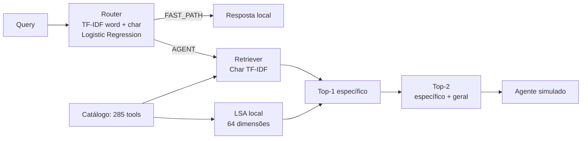

# Case Técnico — Router, Tool Retrieval e Harness de Avaliação

## Visão geral

Este projeto implementa três partes de um agente de atendimento bancário fictício:

1. **Router**: classifica a query como `FAST_PATH` ou `AGENT`.
2. **Tool Retriever**: para queries `AGENT`, seleciona duas tools entre as 285 disponíveis.
3. **Evaluation Harness**: mede qualidade, custo e latência e compara o pipeline com um baseline que sempre chama o LLM simulado.

## Arquitetura final



### Dados e responsabilidades

```text
router_training_data.json → treinamento supervisionado do Router
tools_registry.json       → catálogo indexado pelo Retriever
eval_dataset.json         → avaliação e comparação de alternativas
```

O Retriever não é treinado com os pares de query e tool do `eval_dataset.json`. A LSA usa apenas os textos do catálogo. O eval foi usado para comparar as estratégias, então o resultado final não deve ser tratado como um teste cego.

## Router

O Router combina dois `TfidfVectorizer`:

- unigramas e bigramas de palavras, para capturar expressões de intenção;
- n-grams de caracteres de 3 a 5 posições, para lidar melhor com acentos, flexões e pequenas variações de escrita.

As duas matrizes são unidas com `FeatureUnion` e alimentam uma regressão logística balanceada:

```python
LogisticRegression(
    C=2.0,
    class_weight="balanced",
    max_iter=2000,
    random_state=42,
)
```

Comparei as três configurações com validação cruzada estratificada no conjunto de treino: 5 folds e 10 repetições.

| Features | Accuracy | Balanced accuracy | F1 macro |
|---|---:|---:|---:|
| TF-IDF de palavras | 0,883 | 0,880 | 0,878 |
| TF-IDF de caracteres | 0,877 | 0,873 | 0,871 |
| Palavras + caracteres | **0,890** | **0,887** | **0,886** |

Na avaliação fornecida, com 30 queries:

| Real \ Predito | FAST_PATH | AGENT |
|---|---:|---:|
| FAST_PATH | 10 | 0 |
| AGENT | 0 | 20 |

- Accuracy: **100% (30/30)**.
- Latência total observada: **78,20 ms**.
- Latência média observada: aproximadamente **2,61 ms/query**.

Há exemplos literais presentes tanto no treino quanto no eval. Por isso, os 100% mostram aderência aos dados fornecidos, mas não dizem muito sobre generalização para novas intenções ou formas de escrita.

## Tool Retriever

O ranking principal usa TF-IDF de caracteres sobre o seguinte texto:

```text
nome legível + descrição + categoria
```

A busca é exata por similaridade de cosseno. Com 285 tools, não há necessidade de banco vetorial ou índice aproximado.

O catálogo tem muitas operações quase duplicadas. Em vários casos, a query combina melhor com uma tool específica, enquanto o ground truth aponta para uma tool mais geral. Um exemplo:

```text
Query: Preciso saber o saldo disponível pra pix

Tool específica: consultar_saldo_disponivel_pix
Tool esperada:   consultar_saldo
```

Para não gastar as duas posições do Top-2 com variações muito parecidas, o Retriever monta o resultado desta forma:

1. a primeira posição fica com a tool de maior similaridade com a query;
2. a segunda tenta incluir uma operação geral relacionada;
3. primeiro são verificadas relações fortes entre os nomes, como subconjuntos e núcleos compartilhados;
4. quando o nome não é suficiente, uma LSA de 64 dimensões procura uma tool semanticamente próxima no catálogo.

A LSA é ajustada no `fit` usando somente nomes, descrições e categorias das tools. As matrizes também são calculadas no `fit`; cada `search` precisa apenas vetorizar a nova query e fazer a busca exata.

## Métricas do Retriever

A avaliação isolada usa as 20 queries que possuem `expected_tool`:

| Métrica | Resultado |
|---|---:|
| Hit@1 | 20% (4/20) |
| Hit@2 | **100% (20/20)** |
| Hit@3 | 100% (20/20) |
| Hit@5 | 100% (20/20) |
| MRR | 0,600000 |

O harness mantém o nome `precision_at_k` pedido no case. Como existe apenas uma `expected_tool` por query e o cálculo verifica se ela apareceu no Top-K, essa métrica funciona, na prática, como Hit Rate@K ou Recall@K.

O Hit@1 baixo merece atenção. O primeiro resultado costuma ser a operação mais específica para o texto da query, mas o eval frequentemente espera uma operação genérica. O mock executa somente `top_k_names[0]`, enquanto a métrica considera as duas posições. Em um fluxo real, o agente deveria receber as duas candidatas e decidir qual delas executar.

## Experimentos e trade-offs

As estratégias abaixo foram comparadas no mesmo conjunto fornecido:

| Estratégia | Hit@1 | Hit@2 | Hit@5 |
|---|---:|---:|---:|
| TF-IDF de palavras | 5% | 15% | 70% |
| TF-IDF de caracteres | 20% | 45% | 70% |
| Tool específica + geral por regras de catálogo | 20% | 95% | 95% |
| Tool específica + geral com LSA local | 20% | **100%** | **100%** |

O ganho veio principalmente da forma de usar o Top-2. O TF-IDF de caracteres encontra bem a operação descrita pelo usuário; a segunda vaga cobre a operação geral que o catálogo e o ground truth tratam como equivalente.

Optei pela LSA local porque ela resolveu relações de vocabulário que o ranking lexical não alcançava, sem adicionar download de modelo, chamada externa ou dependência de GPU. O custo fica concentrado na inicialização, e a busca online continua em poucos milissegundos.

## Evaluation Harness

O harness executa o seguinte fluxo para cada query:

1. Router para as 30 queries.
2. Retriever somente quando a rota prevista é `AGENT`.
3. Tool mock e Agent LLM simulado para as queries `AGENT`.
4. Baseline LLM simulado para todas as queries.
5. Cálculo das métricas de qualidade, custo e latência.

Execução de referência:

| Métrica | Resultado |
|---|---:|
| Router accuracy | 100% |
| Retriever `precision_at_k` | 100% (20/20), `k=2` |
| Smart cost | US$ 0,200035 |
| Baseline cost | US$ 0,900000 |
| Economia de custo | 77,7739% |
| Smart latency | 1.126,71 ms |
| Baseline latency | 2.608,18 ms |
| Economia de latência | 56,8009% |

A latência do pipeline inteligente inclui Router, Retriever e Agent LLM simulado. Os valores de custo vêm de `common/mock_llm.py` e são apenas ilustrativos. Como os mocks sorteiam o tempo de espera, os números de latência variam um pouco entre execuções.

## Como executar

Requisitos recomendados:

- Python 3.10 ou superior;
- dependências de `requirements.txt`.

```bash
python -m venv .venv
.venv\Scripts\activate
pip install -r requirements.txt
python -m pytest candidate_starter/tests -v
python -m candidate_starter.run_case
```

O relatório é salvo em `reports/candidate_report.json`.

Os experimentos podem ser reproduzidos separadamente:

```bash
python -m experiments.benchmark_router
python -m experiments.benchmark_sparse_retrieval
```

## Limitações metodológicas da avaliação

O eval tem 30 queries para o Router e 20 queries com `expected_tool` para o Retriever. Uma query representa cerca de 3,33 pontos percentuais no Router e cinco pontos no retrieval.

Parte do eval do Router aparece literalmente no conjunto de treino. Os dados foram mantidos como fornecidos, mas isso deixa a métrica otimista.

No Retriever, o eval foi usado para comparar as alternativas de ranking e escolher a arquitetura final. As queries não entram no `fit`, mas, depois dessa comparação, o conjunto deixa de ser um holdout completamente cego.

Também existe uma limitação no próprio ground truth: há apenas uma tool aceita por query, apesar de o catálogo conter alternativas específicas que parecem igualmente válidas. Relações como `parent_tool`, `specialization_of`, `when_to_use` e `when_not_to_use` tornariam essa decisão explícita.

### Por que o Retriever não foi treinado no eval

O case fornece exemplos rotulados para o Router, mas não fornece um conjunto independente de treino para `query → expected_tool`.

Usar as 20 associações do eval para treinar um reranker, criar aliases específicos ou favorecer determinadas tools e depois medir no mesmo conjunto produziria uma métrica sem valor. Por isso, o runtime aprende apenas com o catálogo. O eval foi usado para diagnóstico e escolha de arquitetura, não como dado supervisionado do ranking.
